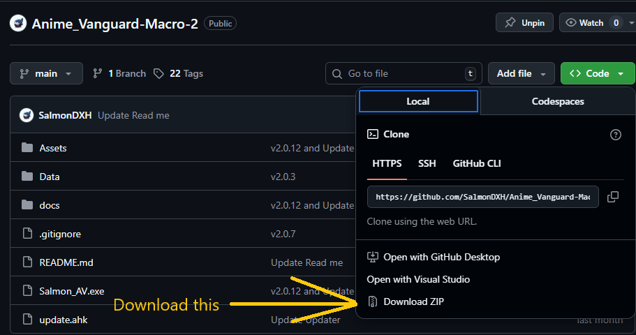

# Salmon's Macro Installation Guide

Easy and fast guide for installation stuff

## Table of Contents

1. [AutoHotkey v2](#autohotkey-v2)
2. [Macro](#macro)
3. [Next](#next-step)

---

## AutoHotkey v2

this macro uses **AutoHotkey v2** as the main programming language so you need to install this to start the macro

- Go to **[Autohotkey website](https://www.autohotkey.com/)** and download **version 2** _([click here to download](https://www.autohotkey.com/download/ahk-v2.exe))_
- After downloading the installer, run the installer _(`.exe`)_ to start installing (mostly it will be in **Download** folder)

## Macro

The macro is compiled into **Machine Language** that only machine can read it so **Window Security** or any **anti-virus app** would detect it as a **Virus**, **Malware** or **Dangerous** program but it is a false positive warning.
Here is some reason why it got detected as a virus:

- **Keyboard access:** Macro use your **hotkey** (keyboard and mouse) to click and move around the game.
- **Microsoft Librabry:** Macro use **Microsoft**'s feature like **OCR** (Image detection), **Screenshot**
- **Http request:** Macro will send **Result**, **Activity logs** via **Discord Webhook**. It also need to ping a **Website** _(I use google to ping)_ if the **Internet** is available or not so it can start reconnect.
- **Application start:** Reconnection use **Deeplink** methods

### Download Macro

- Turn off **Anti-Virus** _(Window Security, ...)_
- Go to **[Github Page](https://github.com/SalmonDXH/Anime_Vanguard-Macro-2)** and click on **Green Code Button**
- It would show **Download Zip** Button then click on it to start downloading _([click here to download](https://github.com/SalmonDXH/Anime_Vanguard-Macro-2/archive/refs/heads/main.zip))_

### Setup Exclusions

To make **Window Security** not deleting the Macro file, we need to create the **Exclusion** folder _(where Window Security would ignore them)_ and put our **Macro** file in there

- Press `Window + I` to open **Settings**
- Go to **Privacy & Security** and go to **Window Security**
- Click **Virus & Threat Protection** and scroll to **Exclusions**
- Click **Add or Remove exclusions** and click **Folder**
- Create or choose a folder _(e.g., `C:\Macros`)_
- Add it as an **Exclusion**
- Then move the `.zip` you dowload earlier then put it into **Exclusion** folder

### Start Macro

- **Important** : Extract `.zip` file
- There would be **`Salmon_UTD.exe`** in after you extract the `.zip`
- Run the `Salmon_UTD.exe`
- **Important:** Enter **YOUR** Discord ID _([Tutorial Video](https://www.youtube.com/watch?v=mc3cV57m3mM))_

## Next Step

- **[⚡Quick Start](quick_start.md)**
- **[📝User Guide](../user-guide/index.md)**

## Support

- **[❓FAQs](https://salmonsproject.site/faqs)**
- **[💬 Discord Server](https://www.discord.gg/salmon)**

---

    

        <h3><strong>Salmon's Projects</strong></h3>
        <a href="https://www.discord.gg/salmon"><strong>Discord Server</strong></a> 💬 | <a href="https://salmonsproject.site/"><strong>Website</strong></a> 🌐
    

